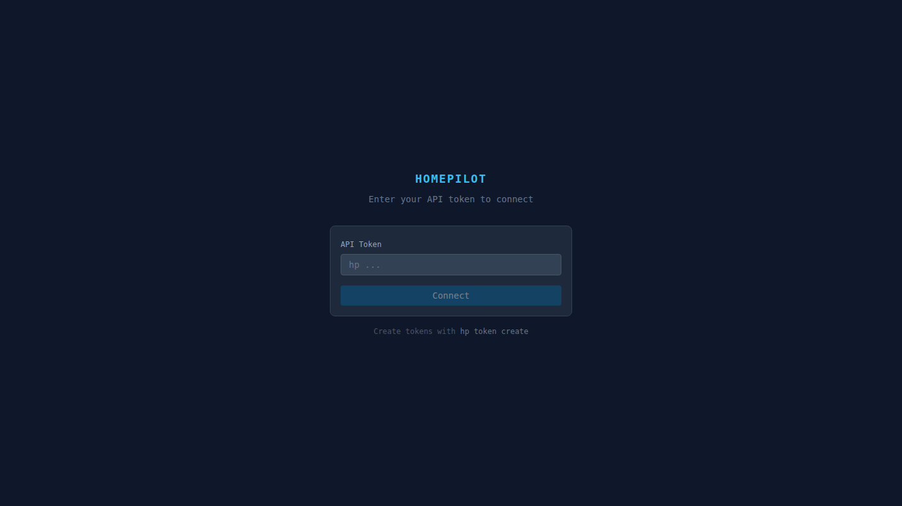
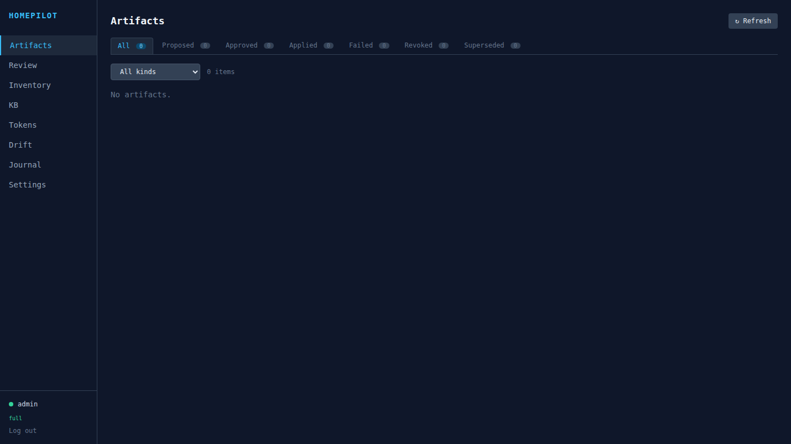
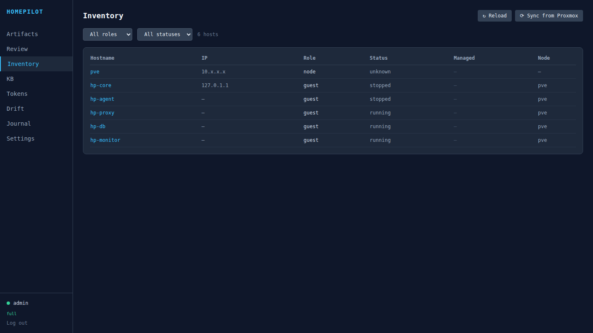
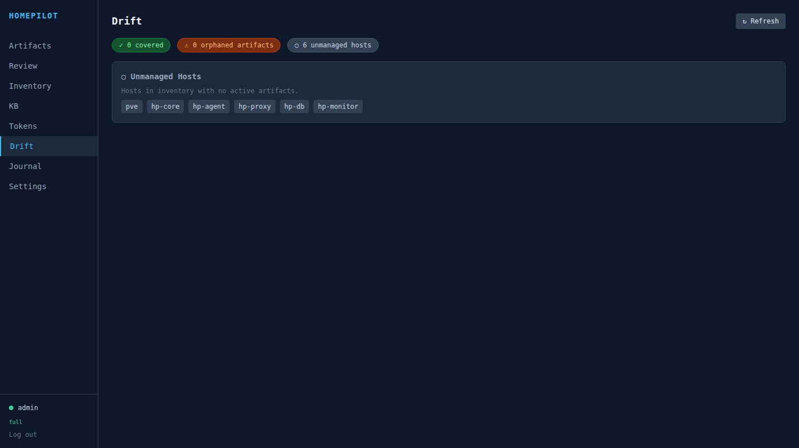
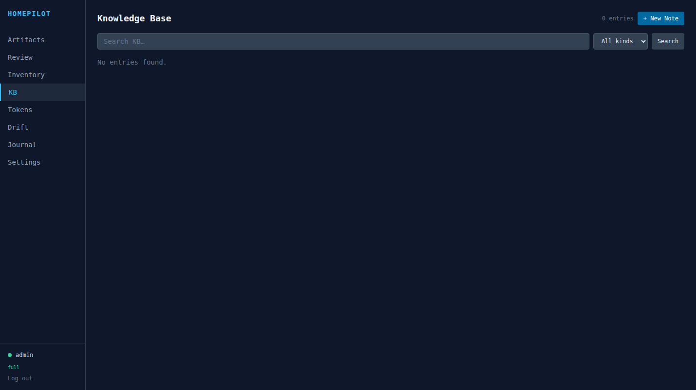
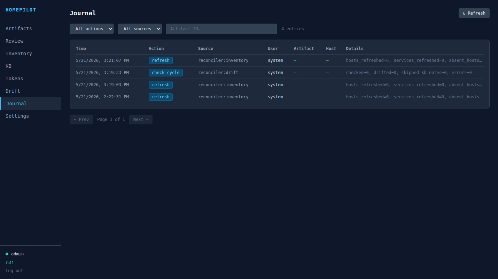
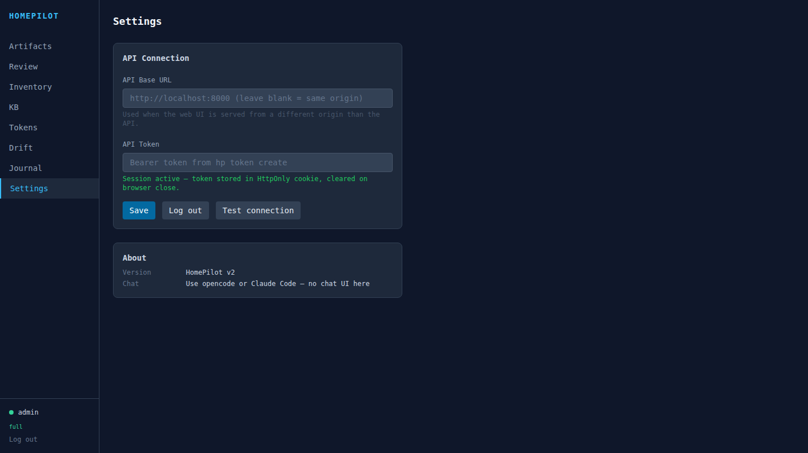
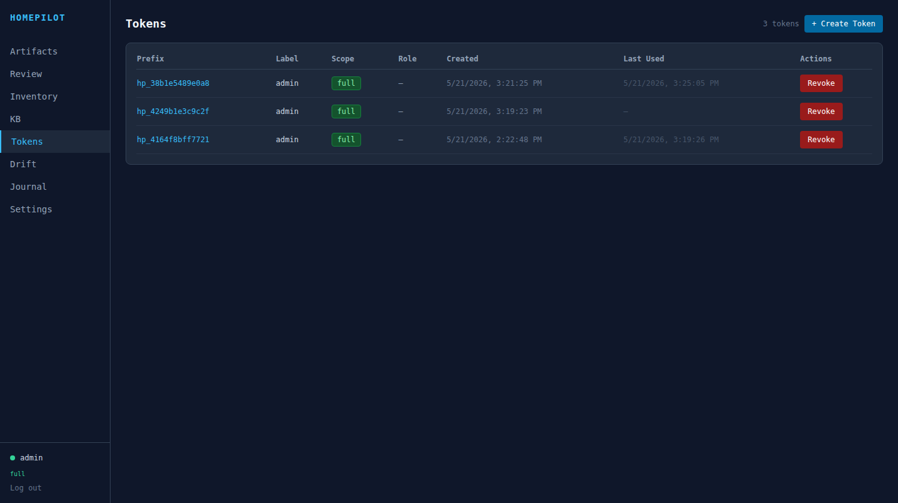
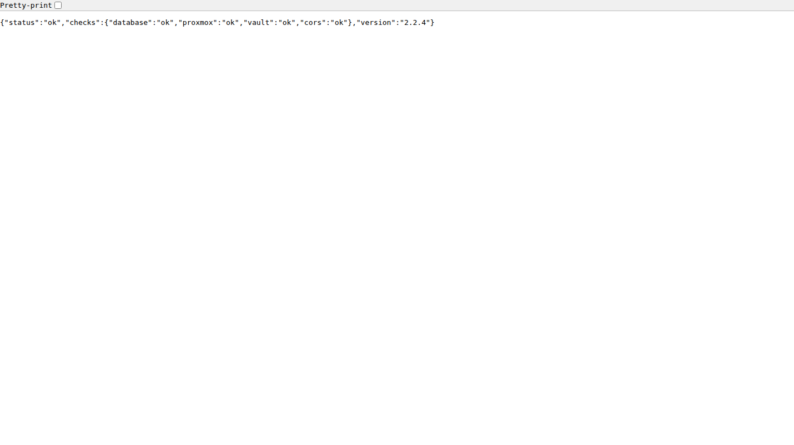
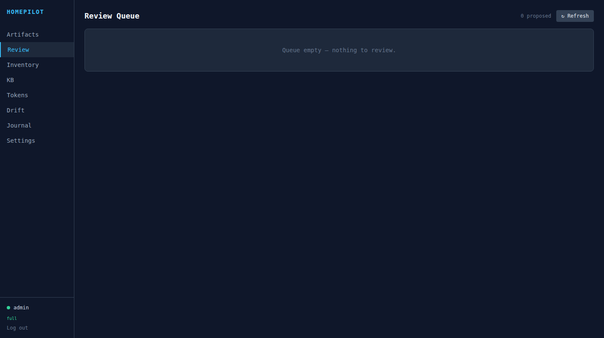

# HomePilot v2

AI-first, artifact-backed, MCP-native homelab management platform.

Manage your homelab through structured artifacts — proposed by AI, reviewed by you, applied through the hp-agent, the Proxmox REST API, or HTTP. Every change is tracked and auditable.

## Quick Start (Docker)

```bash
git clone https://github.com/mtclab/homepilot-core-public.git
cd homepilot-v2
cp .env.example .env
docker compose up -d
```

Then open **http://localhost:8000/ui** (or `http://<host>:8000/ui` from another
machine on the same network) and **claim the instance**: the first-run screen
creates the admin credential and takes your Proxmox address and API token in the
same step. That is the whole install — no shell, no token to copy out of
container output, and nothing to edit in `.env`.

Claim it as soon as you start it: until it is claimed, anyone on the same
network can claim it.

<details>
<summary>Reaching it from outside its own network</summary>

An instance claimed from a public address (a port-forward, a reverse proxy on a
public host) refuses the codeless path and asks for a **claim code** instead.
It is generated on first boot and printed once in the backend log; read it again
at any time with:

```bash
docker compose exec backend hp claim-code
```

Behind a reverse proxy, set `HP_TRUSTED_PROXIES` to the proxy's address so
HomePilot judges the forwarded client rather than the proxy. A forwarding header
from an address that is not listed there is never trusted.
</details>

Everything else — the vault passphrase, the secret key, the database — generates
itself on first boot. `hp init` still exists for scripted installs; it is no
longer the way in.

## Pull from ghcr (no build required)

```bash
HP_IMAGE_TAG=2.8.0 docker compose pull
docker compose up -d
```

Available tags: `latest`, `2.8.0`, `2.7`, `2` — see [Releases](https://github.com/mtclab/homepilot-core-public/releases).

## Services

| Service | Default port | Description |
|---|---|---|
| backend | 8000 | FastAPI + web UI at `/ui` |
| agent hub | 8443 | TCP agent relay (outbound from managed hosts, length-prefixed JSON) |
| n8n | 5678 | Workflow automation (optional, for AI-driven orchestration) |
| searxng | 8080 | Meta-search engine (private, for agent web search) |
| radicale | 5232 | CalDAV/CardDAV server (calendar + contacts) |
| whisper | 8000 | Speech-to-text (CPU, for voice commands) |
| piper | 5000 | Text-to-speech (CPU, for voice replies) |

## Configuration

All settings via environment variables (prefix `HP_`) or `.env` file. See [`.env.example`](.env.example) for the full reference.

Key settings:

| Variable | Default | Description |
|---|---|---|
| `HP_SECRET_KEY` | — | **Required.** Random hex string |
| `HP_DATA_DIR` | `~/.hp` | Data directory (DB, vault, artifacts) |
| `HP_VAULT_PASSPHRASE_FILE` | — | Path to vault passphrase file (Docker secrets recommended) |
| `HP_PROXMOX_HOST` | — | Proxmox VE hostname |
| `HP_ARTIFACTS_REMOTE` | — | Git remote for artifact backup (e.g. `git@github.com:org/homepilot-artifacts.git`) |
| `HP_ARTIFACTS_SSH_KEY` | — | Absolute path to SSH private key for artifacts remote (inside container) |
| `HP_AGENT_HUB_ENABLED` | `true` | Enable agent hub TCP server |
| `HP_AGENT_HUB_HOST` | `0.0.0.0` | Hub bind address |
| `HP_AGENT_HUB_PORT` | `8443` | Hub listen port |
| `HP_AGENT_HUB_AUTH_TOKEN` | auto-generated | Shared secret for agent authentication (generated and persisted on first boot) |
| `HP_AGENT_HUB_TLS` | `true` | TLS on the hub. With no `HP_AGENT_HUB_TLS_CERT`/`_KEY`, a self-signed pair is generated into `<data_dir>/hub/` on first boot and reused |

## Artifact Git Backup

Every artifact write is committed to a local git repo under `HP_ARTIFACTS_DIR`. To push those commits to a remote (e.g. a private GitHub repo) after each write, set:

```env
HP_ARTIFACTS_REMOTE=git@github.com-artifacts:org/homepilot-artifacts.git
HP_ARTIFACTS_SSH_KEY=/home/homepilot/.hp/artifacts_deploy_key
```

Setup steps:
1. Create a private repo (e.g. `org/homepilot-artifacts`)
2. Generate a deploy key: `ssh-keygen -t ed25519 -f artifacts_deploy -N ""`
3. Add the **public** key to the repo with write access
4. Copy the **private** key into your data dir (mounted volume in Docker)
5. Add an SSH alias in `~/.ssh/config` if using a custom host alias:
   ```
   Host github.com-artifacts
     HostName github.com
     IdentityFile /path/to/artifacts_deploy
     IdentitiesOnly yes
   ```
6. Set `HP_ARTIFACTS_REMOTE` and `HP_ARTIFACTS_SSH_KEY` in `.env` and restart

Push failures are non-fatal — HomePilot continues normally if the remote is unreachable.

## Agent Hub

HomePilot manages remote hosts through a lightweight agent daemon. The SSH/jump-server transport was removed - host operations require a connected agent. The agent connects outbound to the hub — no inbound ports needed on managed hosts.

### How it works

0. **Nothing to configure.** The hub is on by default; its shared token and its
   TLS certificate generate themselves on first boot and persist under
   `HP_DATA_DIR` (ADR-004 S3). Explicit settings still override them.
1. **Hub server** runs inside the HomePilot Docker container (TCP port 8443)
2. **Agent daemon** (`hp-agent`) runs on each managed host, connects to hub via persistent TCP
3. **AgentAdapter** routes commands through the hub when an agent is connected
4. Commands are restricted by an allowlist (safe commands always, privileged commands require `HP_AGENT_PRIVILEGED=true` **and** a root systemd unit — see [Privileged installs](#privileged-installs-provisioning))
5. File reads/writes are restricted to allowed path prefixes

### Agent deployment

#### Zero-touch install from the UI (Proxmox guests)

A guest HomePilot already manages, that is **running** and answers on
**qemu-guest-agent**, is enrolled without touching it: open the host in
**Inventory** and press **Install agent**. HomePilot mints a single-use bootstrap
token, stages it (with the hub address and the certificate pin) into the guest's
tmpfs — never onto a command line — and runs the same
`scripts/install-agent.sh` the one-liner below runs. Progress is an
`install_agent` task, and it succeeds only once the agent has actually connected
to the hub; the installer's exit code alone is not treated as enrolment.

The host page states the reason when this path does not apply — the guest is
stopped, it has no qemu-guest-agent, it is not a Proxmox QEMU guest, or it
already has a live agent. Those hosts (and privileged installs, see below) use
the manual installer, which remains fully supported.

#### Manual install

The host agent is a single static Go binary (`hp-agent`) — no Python runtime on
the target. Use a release binary or build from source:

```bash
# Option 1: download the release binary (recommended)
curl -LO https://github.com/mtclab/homepilot-core-public/releases/latest/download/hp-agent-linux-amd64
chmod +x hp-agent-linux-amd64
sudo mv hp-agent-linux-amd64 /usr/local/bin/hp-agent

# Option 2: build from source (Go 1.23+)
cd agent/go && CGO_ENABLED=0 go build -o hp-agent .
scp hp-agent target:/usr/local/bin/

# Configure via environment variables
export HP_AGENT_HUB_HOST=homelab.local
export HP_AGENT_HUB_PORT=8443
export HP_AGENT_AUTH_TOKEN=<token-from-hp-agent-token>

# Or use a one-time bootstrap token (24h expiry, consumed on first connect)
export HP_AGENT_AUTH_TOKEN=hpbat_<bootstrap-token>

# The hub's certificate is self-signed, so tell the agent WHICH certificate is
# the hub's. The fingerprint comes from the UI / GET /agents/token.
export HP_AGENT_TLS=true
export HP_AGENT_TLS_PIN=sha256:<hub_cert_sha256>

hp-agent
```

`scripts/install-agent.sh` is the supported installer: it writes
`/etc/homepilot/agent.env` **and** the matching systemd unit, so the two cannot
disagree. `agent/hp-agent.service` is a reference copy of the unprivileged unit.

### Privileged installs (provisioning)

Privileged mode is what enables the provisioning actions (`install_package`,
`manage_service`, `write_config`) and the privileged command allowlist. It is a
**root grant**, and it must be installed as one — a non-root unit with
`ProtectSystem=strict` cannot carry out a single privileged action (issue #422).

| Install | Runs as | `ProtectSystem` | Writable paths | Grants |
|---|---|---|---|---|
| default | `hp-agent` | `strict` | `/etc/homepilot`, `/opt/homepilot`, `/tmp/homepilot` | read-only allowlist |
| `--privileged` | `root` | `strict` | the write prefixes, exactly | systemctl/docker/file commands, `manage_service`, `write_config` |
| `--allow-package-install` | `root` | `no` | unrestricted | the above **plus** apt/`install_package` |

The **Agents** page renders the exact one-liner, already carrying `--tls` and
`--tls-pin`. The forms below omit them for brevity; a real install needs the pin
whenever the hub uses its generated certificate.

```bash
# unprivileged (default)
curl -fsSL .../install-agent.sh | bash -s -- --hub HOST:PORT --token TOKEN --tls --tls-pin sha256:FP

# privileged: root unit, writes confined to the granted prefixes
... | bash -s -- --hub HOST:PORT --token TOKEN --privileged

# privileged + package management (removes the filesystem write boundary)
... | bash -s -- --hub HOST:PORT --token TOKEN --allow-package-install

# narrow the grant to specific paths (repeatable; /etc/homepilot always included)
... --privileged --write-prefix /etc/nginx --write-prefix /opt/homepilot
```

The installer prints the exact paths and commands it is granting. Security
tradeoffs, in plain terms:

- **A privileged agent is root on that host.** The command allowlist is the
  containment boundary; `ReadWritePaths` confines only the agent's *own* writes,
  not what systemd, dockerd or a package's maintainer scripts do once the agent
  asks them to act.
- **Package management removes the write boundary.** dpkg unpacks into `/usr`,
  `/etc` and `/var`, so `ProtectSystem` has to be off for it. That is why it is a
  separate flag rather than part of `--privileged`.
- **`sudo` is not an allowlisted command anywhere.** A privileged agent is
  already root; an unprivileged one runs under `NoNewPrivileges=yes` where sudo
  could not escalate anyway.
- **The agent fails closed at startup.** If `HP_AGENT_PRIVILEGED` is set but the
  agent is not root, or any configured write prefix is not actually writable, it
  logs which path is wrong and exits non-zero instead of accepting work it
  cannot do.

**Upgrading an agent installed with the broken combination** (2.x installs made
with `--privileged`: `HP_AGENT_PRIVILEGED=true` in `agent.env` while the unit ran
as `User=hp-agent` with `ReadWritePaths=/etc/homepilot`): such an agent will now
**refuse to start** after a binary upgrade — that is intentional, it never worked.
Re-run the installer with the same flags to regenerate the unit:

```bash
curl -fsSL .../install-agent.sh | sudo bash -s -- --hub HOST:PORT --token TOKEN --privileged
```

The agent id and durable token in `/etc/homepilot` are preserved, so the host does
not re-enroll. To keep it unprivileged instead, drop `HP_AGENT_PRIVILEGED` from
`/etc/homepilot/agent.env` and restart.

### Native metrics

Every agent reports CPU count, memory, disk and load over the hub connection it
already holds — no monitoring server, no template import, nothing to configure.
Samples are stored for `HP_METRICS_RETENTION_DAYS` (default 7) and served back
under `/monitoring`; the UI draws them as sparklines on the Agents page.

While the hub is unreachable the agent buffers up to `HP_AGENT_METRICS_BUFFER`
samples (default 1440, roughly three hours at the default cadence) and flushes
them on reconnect, so a backend restart delays the series rather than holing it.
Past that bound the OLDEST samples are dropped first and every drop is logged
with a running total.

### Agent environment variables

| Variable | Default | Description |
|---|---|---|
| `HP_AGENT_HUB_HOST` | `localhost` | Hub server hostname |
| `HP_AGENT_HUB_PORT` | `8443` | Hub server port |
| `HP_AGENT_AUTH_TOKEN` | — | Persistent auth token or one-time bootstrap token |
| `HP_AGENT_PRIVILEGED` | `false` | Enable docker/systemctl/file-management commands + provisioning. Requires a root unit — the agent refuses to start otherwise |
| `HP_AGENT_ALLOW_PACKAGE_INSTALL` | `false` | Additionally enable apt/apt-get and `install_package` |
| `HP_AGENT_WRITE_PREFIXES` | see agent/README | Colon-separated write allowlist. Must match the unit's `ReadWritePaths` |
| `HP_AGENT_TLS` | `false` | Enable TLS for hub connection |
| `HP_AGENT_TLS_PIN` | — | sha256 of the hub certificate (`sha256:<hex>`). Required to verify a self-signed hub; a mismatching certificate is refused, and `HP_AGENT_TLS_INSECURE` cannot override it |
| `HP_AGENT_TLS_CA` | — | CA certificate path for TLS |
| `HP_AGENT_TLS_CERT` | — | Client certificate path for mTLS |
| `HP_AGENT_TLS_KEY` | — | Client key path for mTLS |
| `HP_AGENT_METRICS_ENABLED` | `true` | Report system metrics to the hub. Only an explicit false turns it off |
| `HP_AGENT_METRICS_INTERVAL` | `60` | Seconds between metric samples |
| `HP_AGENT_METRICS_BUFFER` | `1440` | Samples buffered while the hub is unreachable; past it the oldest are dropped (logged) |

### Agent API endpoints

All require API authentication. Endpoints marked **(admin)** require admin scope.

| Method | Path | Scope | Description |
|---|---|---|---|
| GET | `/api/agents/` | read | List connected agents |
| GET | `/api/agents/token` | admin | Get hub auth token for agent config |
| GET | `/api/agents/bootstrap` | admin | Generate one-time bootstrap token |
| GET | `/api/agents/audit` | admin | Query audit log |
| GET | `/api/agents/hostname/{hostname}/connected` | read | Check if agent is connected |
| POST | `/api/agents/host/exec` | admin | Execute an allowlisted command on a host via its connected agent |
| POST | `/api/agents/host/read-file` | admin | Read file from host |
| POST | `/api/agents/host/write-file` | admin | Write file to host (allowed prefixes only) |
| POST | `/api/agents/{agent_id}/exec` | admin | Execute command on specific agent |
| POST | `/api/agents/{agent_id}/read-file` | admin | Read file from specific agent |
| POST | `/api/agents/{agent_id}/write-file` | admin | Write file to specific agent |

### Metrics API endpoints

Mounted at `/monitoring`, not `/metrics`: the latter is the public Prometheus
exposition endpoint and these routes are authenticated.

| Method | Path | Scope | Description |
|---|---|---|---|
| GET | `/monitoring/hosts/{hostname}/series?metric=&hours=` | read | One series over a window, oldest point first (at most 2000 points; `truncated` says when older points were left out) |
| GET | `/monitoring/hosts/{hostname}/latest` | read | Newest value of every metric this host reports |
| GET | `/monitoring/rules` | read | List alert rules |
| POST | `/monitoring/rules` | admin | Create an alert rule (`metric`, `comparison`, `threshold`, `for_seconds`, `host_filter`) |
| PATCH | `/monitoring/rules/{rule_id}` | admin | Silence (`{"enabled": false}`) or re-enable a rule without losing it |
| DELETE | `/monitoring/rules/{rule_id}` | admin | Delete an alert rule and its state |
| GET | `/monitoring/alerts` | read | Alerts currently firing |

A rule fires only when its condition holds for the whole `for_seconds` span, so a
single spike never pages anyone, and it emits `alert_firing` / `alert_resolved`
through the existing SSE + webhook event machinery. Rules are managed from the
**Agents** page (Alert Rules), which is also where each host's sparklines and
recent-metrics panel live.

### Agent CLI commands

```bash
hp agent token          # Show hub auth token
hp agent bootstrap      # Generate one-time bootstrap token
hp agent list           # List connected agents
```

## CLI

```bash
hp init                       # scripted setup: .env, database, vault secrets, API token
                              #   (the browser claim replaces this for a normal install)
hp claim-code                 # print the claim code of an unclaimed instance
                              #   (only needed when it is reached from outside its own network)
hp mcp-serve                  # start the MCP server (stdio or HTTP)
hp status                     # show daemon info, vault state, artifact counts
hp artifacts list             # list artifacts
hp artifacts show <id>        # show artifact detail
hp artifacts approve <id>     # approve a proposed artifact
hp artifacts reject <id>      # reject a proposed artifact
hp artifacts apply <id>       # apply an approved artifact
hp artifacts edit <id>        # open artifact in editor
hp artifacts revoke <id>      # revoke an applied artifact
hp artifacts replay <id>      # re-apply an already-applied artifact
hp artifacts push             # push artifact git repo to remote
hp artifacts pull             # pull artifact git repo from remote
hp artifacts sync-status      # show git sync status of artifacts
hp inventory refresh          # sync inventory from Proxmox
hp inventory list             # list hosts and services
hp inventory show <host>      # show host detail
hp drift                      # detect drift across all applied artifacts
hp doc <topic>                # look up environment documentation
hp export                     # export DB + artifacts as tarball (NO secrets - cannot restore a host)
                              #   --include-secrets makes it restorable (holds the vault: treat as a credential)
hp import <file>              # restore from tarball (stop the backend first)
hp policy init                # global interactive onboarding to seed the policy KB
hp kb reindex                 # rebuild KB search index from artifacts
hp token create               # create an API token
hp token list                 # list API tokens (prefix, label, scope, last-used)
hp token revoke               # revoke an API token by its prefix
hp invite create              # mint a one-time, CN-bound self-service provisioning invite
hp invite list                # list invites (prefix, CN, caps, expiry, state - never tokens)
hp invite revoke <prefix>     # revoke an unredeemed invite by its prefix
hp vault set <name>           # store a JSON secret in the vault
hp vault get <name>           # retrieve a secret from the vault
hp vault list                 # list secret names
hp vault delete <name>        # delete a secret
hp webhook add                # register a webhook endpoint
hp webhook list               # list webhook configurations
hp webhook delete             # remove a webhook endpoint
hp webhook test               # send a test event to a webhook
hp agent token                # show hub auth token for agent config
hp agent bootstrap            # generate one-time bootstrap token
hp agent list                 # list connected agents
hp agent revoke               # revoke an agent's per-agent credential
```

## MCP Server

**stdio** (local, Claude Code / opencode on the same machine):

```bash
hp mcp-serve
```

```json
{
  "mcpServers": {
    "homepilot": { "command": "hp", "args": ["mcp-serve"] }
  }
}
```

**HTTP** (remote server — recommended when AI client runs elsewhere, e.g. Kasm workspace):

```bash
HP_MCP_TOKEN=<secret> hp mcp-serve --transport http --host 0.0.0.0 --port 8000
```

```json
{
  "mcpServers": {
    "homepilot": {
      "url": "http://<homelab-ip>:8000/mcp",
      "headers": { "Authorization": "Bearer <secret>" }
    }
  }
}
```

## Vault

Secrets are encrypted with [age](https://age-encryption.org/) via the `pyrage` Python library — no system binary required. The master identity is protected with AES-256-GCM derived from your vault passphrase.

Use Docker secrets for the passphrase:

```env
HP_VAULT_PASSPHRASE_FILE=/run/secrets/hp_vault_passphrase
```

## Releases

Releases are cut by **manual workflow dispatch** on the public mirror — there is
no tag-push trigger, and the release pipeline runs **no test/lint/type gate**
(verification is the local `make gate`, run before promotion).

The chain: sync the reviewed change to the public mirror's `main`, then dispatch
`auto-tag.yml`. If `pyproject.toml`'s version has no matching tag, it creates and
pushes `v<version>` and dispatches `release.yml`, which:

1. Builds and pushes the Docker image (**`linux/amd64` only**) to `ghcr.io/mtclab/homepilot-core-public`
2. Cross-compiles the `hp-agent` Go binary for `linux/amd64` **and** `linux/arm64`
3. Publishes a GitHub Release with auto-generated notes and the agent binaries

Do not `git tag` by hand — `auto-tag.yml` owns tagging.

## Development

```bash
python -m venv .venv && source .venv/bin/activate
pip install -e ".[dev]"

# backend (uvicorn)
HP_SECRET_KEY=dev uvicorn homepilot.main:app --reload

# web UI (separate terminal)
cd web && npm install && npm run dev
```

Tests:

```bash
pytest tests/ --ignore=tests/test_e2e.py -v   # unit + integration (no server)
mypy src/
ruff check src/

# e2e against live instance
HP_TEST_TOKEN=hp_... pytest tests/test_e2e.py -v
```

See [`docs/testing.md`](docs/testing.md) for the full testing guide including manual smoke test checklist and dev server details.

## Events & Webhooks

HomePilot emits SSE events for artifact lifecycle changes (proposed, approved, applied, etc.) and drift detection. Events stream to connected clients at `/events` and can trigger outbound webhooks. See [`docs/EVENTS.md`](docs/EVENTS.md) for the event schema and [`docs/ARCHITECTURE.md`](docs/ARCHITECTURE.md) for the webhook delivery system.

All state transitions write an append-only audit log stored in SQLite. Use `hp status` or the API to query it.

## Architecture

- [`docs/ARCHITECTURE.md`](docs/ARCHITECTURE.md) — deployment topology, artifact lifecycle, MCP tools reference
- [`docs/ARTIFACT_SPEC.md`](docs/ARTIFACT_SPEC.md) — artifact file format and executor spec
- [`docs/EVENTS.md`](docs/EVENTS.md) — event and webhook payload schema
- [`docs/testing.md`](docs/testing.md) — unit, e2e, and manual smoke tests
- [`docs/deployment.md`](docs/deployment.md) — step-by-step Docker deployment
- [`docs/portal.md`](docs/portal.md) — the `/invite/*` self-service provisioning portal: nginx block, mint→redeem flow, trust model

> Historical planning and design docs are in [`docs/archive/`](docs/archive/) — do not use for reference.

## Screenshots

| Login | Artifacts | Inventory |
|------|-----------|-----------|
|  |  |  |

| Drift Detection | Knowledge Base | Journal |
|----------------|----------------|---------|
|  |  |  |

| Settings | Tokens | Health | Review |
|----------|--------|--------|--------|
|  |  |  |  |

## License

AGPL-3.0
